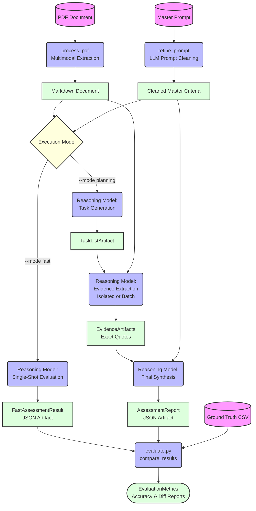

# AI-Assisted RRP Analysis Tool

## Overview

The **AI-Assisted RRP (Responsible Research Practices) Analysis Tool** is an advanced, agentic evaluation pipeline built to assess research papers against predefined scientific and methodological criteria. The system reads research paper PDFs, converts them to structured markdown using multimodal extraction, and leverages Google's Gemini models to assess the presence or absence of Responsible Research Practices (RRPs).

The tool is highly modular, configurable via a CLI (`main.py`), and designed to enforce strict structural constraints using Pydantic schemas. It supports both a "Fast" single-pass evaluation and a complex, multi-stage "Planning" evaluation that mimics human cognitive processes to mitigate AI hallucinations and affirmative bias.

## Core Architecture

The project now utilizes a modern `src/rrp_eval/` package structure:

- **`cli.py`**: The Typer CLI entry point (`rrp-eval`). It orchestrates concurrent batch processing of PDFs and implements user-friendly flags.
- **`agent.py`**: The asynchronous LLM orchestration layer. It handles interactions with the Google GenAI API using `asyncio`, drastically reducing execution time for multiple PDFs.
- **`evaluate.py`**: The scoring and comparison engine. It calculates accuracy metrics and generates diff reports.
- **`schema.py`**: Defines the rigorous Pydantic data models enforcing structured JSON outputs. `AssessmentReport` is now the universal output format for both fast and planning modes.
- **`config.py`**: Manages environment variables and parses `eval_profiles.toml`, allowing seamless switching between different API keys and model configurations.
- **`logger.py`**: Implements a robust `Loguru` logger with automatic file rotation and visual console output, intelligently muting noisy third-party APIs.

## Configuration Profiles

Manage your API keys securely using the `eval_profiles.toml` file at the root. You can switch profiles via the CLI:
```bash
uv run rrp-eval evaluate --target resources/data/papers/ --profile prompt_optimization
```

## Execution Pipelines

The tool routes the parsed markdown and the master criteria through one of two distinct pipelines:

### 1. Fast Mode
A rapid, single-shot evaluation. The entire markdown text and the cleaned master criteria are fed into the reasoning model in a single prompt. The model outputs a definitive `FastAssessmentResult` containing boolean answers and justifications. This is fast but more susceptible to hallucinations on complex or highly nuanced papers.

### 2. Planning Mode
A multi-stage, methodical evaluation pipeline engineered for high fidelity and traceability.
1. **Task Generation**: The master criteria is broken down logically into `TaskGroup`s and specific `SubTask`s.
2. **Evidence Extraction**: The model acts as a focused extractor. It scans the paper specifically to locate and copy exact quotes addressing the tasks. This step can be executed iteratively per question (`isolated` strategy) or per group (`batch` strategy).
3. **Synthesis & Assessment**: A final reasoning pass evaluates the extracted evidence (ignoring the original document to strictly prevent affirmative bias) to render final True/False decisions and justifications, outputting an `AssessmentReportArtifact`.

## Evaluation & Metrics

The system natively supports evaluating its own performance. By providing an expected CSV file mapping study numbers and prompt numbers to correct answers, the tool calculates accuracy percentages and flags diverging answers, storing all artifacts in an organized timestamped `output/` directory.

## Pipeline Flow Visualization


