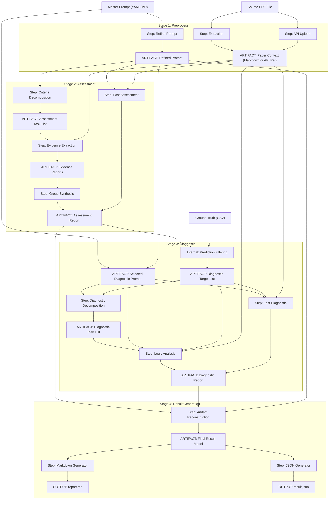

# Research Evaluation Pipeline

The Research Evaluation Pipeline is a framework designed for the automated assessment and diagnostic analysis of research papers using large language models. It provides a structured workflow to ingest documents, evaluate them against specific criteria, and perform root-cause analysis on discrepancies between model predictions and ground truth data.

## Execution Architecture

The following diagram illustrates the complete data flow and execution architecture of the pipeline. It highlights the production of granular artifacts within each stage and the cross-stage dependencies that drive the reasoning process.



## Features

- **Multi-Stage Pipeline**: Modular execution flow including preprocessing, assessment, diagnostic, and results stages.
- **Automated Reporting**: Generation of comprehensive Markdown and JSON reports comparing model assessments against ground truth data.
- **Granular Control**: Ability to run the entire pipeline, specific stages, or individual atomic steps.
- **Deterministic Tracking**: Content-based hashing and key building for consistent artifact management and caching.
- **Multi-Client Provider Architecture**: Protocol-based architecture designed to support multiple LLM providers. A Google Gemini client is currently provided as the reference implementation.
- **Flexible Configuration**: Support for multiple execution profiles and client configurations via TOML files.
- **Persistent Artifact Store**: SQLite-based caching system to minimize redundant API calls and facilitate development.

## Project Structure

- `src/research_evaluation_pipeline`: Core logic and CLI implementation.
- `resources/`: Directory for input data and configurations. **Note**: As specified in `.gitignore`, local assets such as PDFs, databases, and convenience artifacts are excluded from the repository and must be populated by the user before execution.
- `resources/profiles`: Example configuration files for execution strategies and client settings.
- `resources/papers`: Target directory for source PDF documents.
- `resources/prompts_default.yaml`: A provided set of default system and user prompts for various pipeline stages.
- `resources/prompts_master.yaml`: The primary registry for evaluation criteria. This file should be populated by the user with specific master instructions.
- `output`: Destination for generated JSON and Markdown reports.

## Installation

### Prerequisites

This project requires `uv` for dependency management and Python execution.

#### Installing uv via Homebrew (Recommended)

To install `uv` on macOS using Homebrew, run:

```bash
brew install uv
```

#### Installing uv via Curl

Alternatively, you can install `uv` using the official installation script:

```bash
curl -LsSf https://astral.sh/uv/install.sh | sh
```

### Project Setup

**Synchronize Environment**: Navigate to the project directory and run:
```bash
uv sync
```
**Populate Resources**:
-   Add your research papers (PDFs) to the `resources/papers/` directory.
-   Ensure your ground truth files are available in the `resources/` folder.
-   While a default set of pipeline prompts is provided in `resources/prompts_default.yaml`, you should populate `resources/prompts_master.yaml` with your specific evaluation criteria.

## Configuration

### API Credentials

The pipeline utilizes the `keyring` library to securely manage API keys. Users must ensure that the appropriate API keys are stored in the system keychain using the service and account identifiers defined in the client profiles (e.g., `resources/profiles/client.toml`).

### Execution Profile Reference

Example execution profiles are defined in `resources/profiles/execution.toml`. Each profile controls the behavior, model selection, and strategies for the entire pipeline.

#### Global Settings
- `ingestion_mode`: Determines how paper content is provided to models (`extraction` for Markdown conversion, `upload` for direct PDF binary upload).

#### Preprocess Stage
- **Refinement**: Configures how master criteria are cleaned. Includes `model`, `temperature`, `cache_policy`, and `strategy` (`standard` or `semantic`).
- **Extraction**: Configures PDF-to-Markdown conversion. Includes `model`, `temperature`, and `cache_policy`.

#### Assessment Stage
- `fragmentation`: High-level execution mode. `fast` for single-pass assessment, `plan` for multi-step reasoning (decomposition -> extraction -> synthesis).
- **Decomposition**: Settings for breaking down criteria. Strategy can be `semantic` or `structural`.
- **Extraction**: Settings for evidence location. Includes `processing_mode` (`sequential` or `concurrent`).
- **Synthesis**: Settings for final reasoning over evidence. Strategy can be `concise`, `analytical`, or `verbose`.

#### Diagnostic Stage (Optional)
- `fragmentation`: `fast` for single-pass analysis, `plan` for multi-step root cause analysis.
- `prompt_source`: Determines whether to use the `master` or `refined` prompt for diagnostics.
- **Decomposition**: Settings for error batching. Strategy defaults to `thematic`.
- **Analysis**: Settings for mismatch detection. Strategies include `diagnose-all`, `diagnose-mismatches`, `diagnose-matches`, etc.

#### Results Stage (Optional)
- **Artifact Reconstruction**: Logic for merging fragmented assessment and diagnostic artifacts into a unified data model.
- **Multi-Format Export**: Automated generation of results in both human-readable Markdown and machine-readable JSON formats.
- **Ground Truth Comparison**: Integrated logic for calculating accuracy and identifying discrepancies between model predictions and provided ground truth.

### Provider Architecture

The system is designed with a multi-client provider architecture to support various LLM services. The Google Gemini client is currently implemented as the primary example of this architecture.

## Usage

The primary entry point for the pipeline is the `rrp` command.

### Run Full Pipeline

Execute the end-to-end assessment for a specific paper:

```bash
uv run rrp run-pipeline \
    --paper-path <paper_path> \
    --prompt-path <prompt_path> \
    --prompt-key <prompt_key> \
    --ground-truth-path <ground_truth_path> \
    --profile <profile_name> \
    --client-profile <client_profile_name> \
    --execution-profiles <execution_profiles_path> \
    --client-profiles <client_profiles_path>
```

### Run Specific Stage

Execute a single stage of the research pipeline (preprocess, assessment, diagnostic, results):

```bash
uv run rrp run-stage <stage_name> \
    --paper-path <paper_path> \
    --prompt-path <prompt_path> \
    --prompt-key <prompt_key> \
    --ground-truth-path <ground_truth_path> \
    --profile <profile_name> \
    --client-profile <client_profile_name>
```

### Run Specific Step

Execute a granular atomic step (e.g., refine, extract, decompose, synthesize, analyze):

```bash
uv run rrp run-step <stage_name> <step_name> \
    --paper-path <paper_path> \
    --prompt-path <prompt_path> \
    --prompt-key <prompt_key> \
    --ground-truth-path <ground_truth_path> \
    --profile <profile_name> \
    --client-profile <client_profile_name>
```

### Database Management

The `db` command group provides utilities for managing the local artifact cache.

- **Wipe database**: `uv run rrp db clear`
- **Seed database**: `uv run rrp db seed`
- **Capture artifacts**: `uv run rrp db capture`

### Convenience Scripts

The `scripts/` directory contains shell scripts that provide shortcuts for common execution patterns. These scripts are configured to use the suggested directory structure within the `resources/` folder to streamline the workflow.

- `run_pipeline.sh`: Runs the full pipeline with configurable parameters.
- `run_stage.sh`: Runs a specific pipeline stage.
- `run_step.sh`: Runs a granular atomic step.

Example:
```bash
./scripts/run_pipeline.sh <profile_name> <client_profile_name> <paper_path>
```

## Development

### Running Tests

Execute the test suite using `pytest`:

```bash
uv run pytest
```
