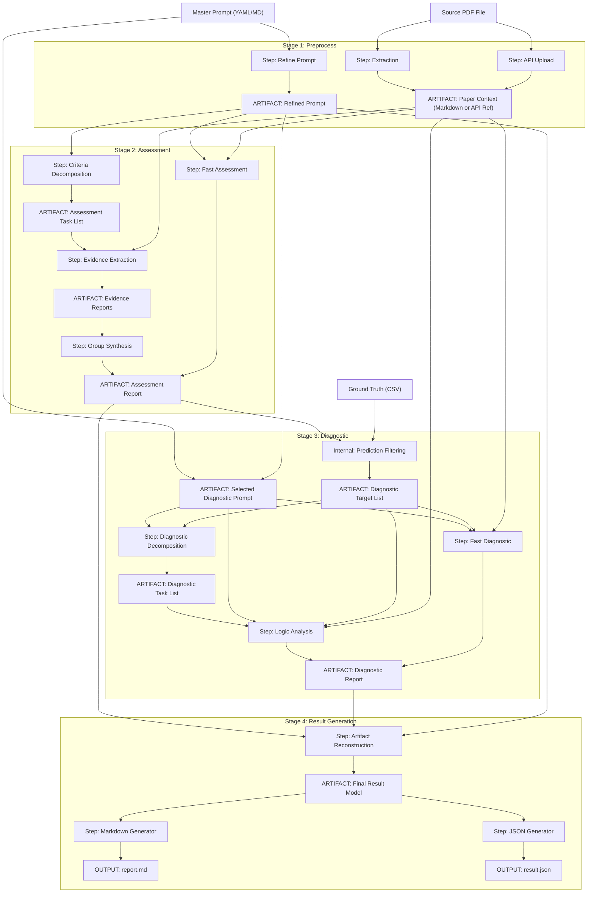

# Research Evaluation Pipeline

This pipeline automates the evaluation and diagnostic analysis of research papers using Large Language Models (LLMs). It manages document ingestion, criteria-based assessment, and root-cause analysis of discrepancies between model outputs and ground truth.

## Execution Architecture

This diagram shows the pipeline's data flow, execution architecture, and the artifacts generated at each stage.



## Features

- **Multi-Stage Execution**: Modular workflow covering preprocessing, assessment, diagnostics, and results generation.
- **Automated Reporting**: Generates Markdown and JSON reports with ground truth comparison metrics.
- **Granular Execution**: Run the full pipeline, specific stages, or individual atomic steps via the CLI.
- **Deterministic Caching**: Content-based hashing ensures consistent artifact management and avoids redundant computation.
- **Provider Agnostic**: Protocol-based architecture supporting multiple LLM providers (Google Gemini included).
- **TOML-Based Config**: Manage complex execution profiles and client credentials via TOML files.
- **SQLite Artifact Store**: Local caching system to reduce API latency and costs during development.

## Project Structure

- `src/research_evaluation_pipeline`: Core logic and CLI implementation.
- `resources/`: Directory for input data and configurations.
- `resources/profiles`: Example configuration files for execution strategies and client settings.
- `resources/papers`: Target directory for source PDF documents.
- `resources/prompts_default.yaml`: A provided set of default system and user prompts for various pipeline stages.
- `resources/prompts_master.yaml`: The primary registry for evaluation criteria. This file should be populated by the user with specific master instructions.
- `output`: Destination for generated JSON and Markdown reports.

## Installation

### Prerequisites

This project requires `uv` for dependency management and Python execution.

#### Installing uv via Homebrew (Recommended)

To install `uv` on macOS using Homebrew, run:

```bash
brew install uv
```

#### Installing uv via Curl

Alternatively, you can install `uv` using the official installation script:

```bash
curl -LsSf https://astral.sh/uv/install.sh | sh
```

### Project Setup

**Synchronize Environment**: Navigate to the project directory and run:
```bash
uv sync
```

#### Prompt Data Structure
The pipeline supports various formats for evaluation criteria:

-   **Standalone Files** (`.md`, `.txt`): The entire file content is treated as the master prompt.
-   **Prompt Registries** (`.yaml`, `.json`): A dictionary of multiple prompts. Requires the `--prompt-key` argument to select a specific instruction set.

#### Ground Truth Data Structure
To enable accuracy reporting and diagnostic analysis, your ground truth CSV must adhere to the following specification:

-   **Delimiter**: Semicolon (`;`).
-   **Required Columns**:
    -   `study_number`: Identifier matching the paper filename stem (e.g., `0400.pdf` -> `400`).
    -   `prompt_number`: Criterion identifier matching the prompt registry (e.g., `1`, `2a`).
    -   `answer`: Binary integer where `1` is **True** and `0` is **False**.

*Note: If you intend to use a custom csv structure, make sure to update the `_load_ground_truth_from_path` method in `src/research_evaluation_pipeline/cli.py` accordingly.*

## Configuration

### API Credentials

The pipeline utilizes the `keyring` library to securely manage API keys. Users must ensure that the appropriate API keys are stored in the system keychain using the service and account identifiers defined in the client profiles (e.g., `resources/profiles/client.toml`).

### Execution Profile Reference

Example execution profiles are defined in `resources/profiles/execution.toml`. Each profile controls the behavior, model selection, and strategies for the entire pipeline.

#### 1. General Step Settings
All atomic steps (e.g., Refinement, Decomposition, Synthesis) share a common foundation defined by the `StepSettings` model:

-   `model`: The identifier of the LLM model to use.
    -   *Options (Example Implementation)*: `gemini-2.5-flash`, `gemini-2.5-pro`, `gemini-3-flash-preview`, `gemini-3.1-pro-preview`, etc.
-   `temperature`: Controls the randomness of the generation.
-   `cache_policy`: Rules for interacting with the local artifact store.
    -   `use-cache`: Use existing artifacts if available (default).
    -   `bypass-cache`: Execute the step and store the result, ignoring existing artifacts.
    -   `overwrite-cache`: Execute the step and overwrite any existing artifacts.

#### 2. Pipeline Configuration
Global settings that affect the overall data flow:

-   `ingestion_mode`: How paper content is provided to the models.
    -   `extraction`: Converts PDF to Markdown via a dedicated extraction step.
    -   `upload`: Directly uploads the PDF binary to the model's file API.

---

#### Stage 1: Preprocess
Prepares evaluation criteria and extracts paper content for processing.

-   **Refinement**: Structures and cleans the master criteria into a refined prompt.
    -   `strategy`:
        -   `standard`: Directly structures the master criteria.
        -   `semantic`: Resolves semantic ambiguities and improves criteria phrasing.
-   **Extraction**: Converts source PDFs into structured Markdown (active only if `ingestion_mode` is `extraction`).

---

#### Stage 2: Assessment
Assesses papers against defined criteria using single-pass or multi-step reasoning.

-   `fragmentation`: High-level execution architecture.
    -   `fast`: Performs a single-shot assessment.
    -   `plan`: Executes a multi-step chain.
-   **Decomposition**: Breaks down the evaluation criteria into atomic task groups.
    -   `strategy`:
        -   `semantic`: Groups criteria by logical intent.
        -   `structural`: Groups criteria based on the paper's section hierarchy.
-   **Extraction**: Locates and extracts verbatim evidence for each task.
    -   `strategy`:
        -   `standard`: Standard evidence location logic.
    -   `processing_mode`:
        -   `concurrent`: Parallel execution of evidence extraction tasks.
        -   `sequential`: Serial execution to manage API rate limits.
-   **Synthesis**: Renders final scores and reasoning based on extracted evidence.
    -   `strategy`:
        -   `analytical`: Balanced reasoning with evidence cross-referencing.
        -   `concise`: Final scores with minimal explanation.
        -   `verbose`: Comprehensive reports with exhaustive evidence logs.

---

#### Stage 3: Diagnostic (Optional)
Identifies and analyzes discrepancies between model assessments and ground truth.

-   `fragmentation`:
    -   `fast`: Single-shot diagnostic analysis.
    -   `plan`: Multi-step diagnostic analysis.
-   `prompt_source`: Determines which criteria prompt to use for analysis.
    -   `master`: Uses original evaluation criteria.
    -   `refined`: Uses the prompt from the Preprocess stage.
-   **Decomposition**: Groups assessment errors for thematic analysis.
    -   `strategy`:
        -   `thematic`: Groups errors by common logical themes.
-   **Analysis**: Performs the root-cause analysis on the identified errors.
    -   `strategy`:
        -   `diagnose-all`: Analyzes every prediction.
        -   `diagnose-mismatches`: Analyzes only model/ground-truth disagreements.
        -   `diagnose-matches`: Analyzes cases where the model correctly matched ground truth.
        -   `diagnose-overpredictions`: Specifically targets false positives.
        -   `diagnose-underpredictions`: Specifically targets false negatives.
    -   `processing_mode`:
        -   `concurrent`: Parallel analysis.
        -   `sequential`: Serial analysis.

---

#### Stage 4: Results
Aggregates results and generates final reports.

-   **Artifact Reconstruction**: Merges fragmented assessment and diagnostic artifacts into a unified data model.
-   **Multi-Format Export**: Generates human-readable Markdown and machine-readable JSON reports.
-   **Ground Truth Comparison**: Calculates accuracy metrics and identifies discrepancies between model predictions and ground truth.

### Provider Architecture

The pipeline uses a multi-client architecture to support various LLM providers. Google Gemini is the current reference implementation.

## Usage

The primary entry point for the pipeline is the `rrp` command.

### Run Full Pipeline

Execute the end-to-end assessment for a specific paper:

```bash
uv run rrp run-pipeline \
    --paper-path <paper_path> \
    --prompt-path <prompt_path> \
    --prompt-key <prompt_key> \
    --ground-truth-path <ground_truth_path> \
    --profile <profile_name> \
    --client-profile <client_profile_name> \
    --execution-profiles <execution_profiles_path> \
    --client-profiles <client_profiles_path>
```

### Run Specific Stage

Execute a single stage of the research pipeline (preprocess, assessment, diagnostic, results):

```bash
uv run rrp run-stage <stage_name> \
    --paper-path <paper_path> \
    --prompt-path <prompt_path> \
    --prompt-key <prompt_key> \
    --ground-truth-path <ground_truth_path> \
    --profile <profile_name> \
    --client-profile <client_profile_name>
```

### Run Specific Step

Execute a granular atomic step (e.g., refine, extract, decompose, synthesize, analyze):

```bash
uv run rrp run-step <stage_name> <step_name> \
    --paper-path <paper_path> \
    --prompt-path <prompt_path> \
    --prompt-key <prompt_key> \
    --ground-truth-path <ground_truth_path> \
    --profile <profile_name> \
    --client-profile <client_profile_name>
```

### Database Management

The `db` command group provides utilities for managing the local artifact cache.

- **Wipe database**: `uv run rrp db clear`
- **Seed database**: `uv run rrp db seed`
- **Capture artifacts**: `uv run rrp db capture`

### Convenience Scripts

The `scripts/` directory contains shell scripts that simplify common execution patterns by leveraging the `resources/` directory conventions.

#### Script Configuration
These scripts are pre-configured to map the following local paths to the corresponding `rrp` CLI arguments:
-   `--paper-path`: Maps to `resources/papers/<paper_name>.pdf`
-   `--prompt-path`: Maps to `resources/prompts_master.yaml`
-   `--ground-truth-path`: Maps to `resources/correct_answers.csv`

#### Populating Resources for Scripts
To use these scripts, organize your data as follows:
1.  **Papers**: Add source PDFs to `resources/papers/`.
2.  **Ground Truth**: Name your CSV `correct_answers.csv` and place it in the `resources/` directory.
3.  **Criteria**: Populate `resources/prompts_master.yaml` with your criteria (this file includes several example prompts for reference).

**Available Scripts**:
-   `run_pipeline.sh`: Executes the full end-to-end pipeline.
-   `run_stage.sh`: Executes a specific pipeline stage (e.g., `preprocess`).
-   `run_step.sh`: Executes a granular atomic step (e.g., `refine`).

**Example Usage**:
```bash
./scripts/run_pipeline.sh <profile_name> <client_profile_name> <paper_path>
```
*Note: If you require custom file locations outside of these conventions, use the `rrp` CLI directly.*

## Development

### Running Tests

Execute the test suite using `pytest`:

```bash
uv run pytest
```
